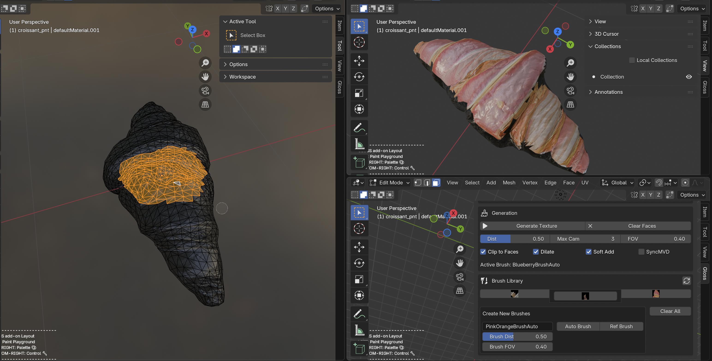

<h1 align="center">GLOSS-BLENDER 🎨</h1>

<p align="center"><b>A Blender add-on for reference-based interactive texture fill</b></p>

<div align="center">
    
</div>

---

## 🛠️ Installation

1. Copy or symlink this folder into your Blender add-ons directory as `gloss-blender`:

   | OS | Add-ons directory |
   |---|---|
   | macOS | `~/Library/Application Support/Blender/4.5/scripts/addons/` |
   | Windows | `%APPDATA%\Blender Foundation\Blender\4.5\scripts\addons\` |

2. Install the Python dependencies into Blender's Python:

   ```bash
   python -m pip install -r requirement.txt
   ```

3. Download the example dataset (about 1.6 GB) into `data/`:

   ```bash
   pip install huggingface_hub
   python data/download.py
   ```

4. In Blender, open `Edit > Preferences > Add-ons` and enable **gloss-blender**.
5. Open one of the `blender-session/demo.blend` files. It already has the two-viewport layout the add-on expects.

   <details>
   <summary><b>Optional</b> — build the layout in a fresh file</summary>

   - Press `N` in the 3D View and open the **Gloss** tab.
   - Split the 3D View into two viewports: right-click the viewport's edge and choose **Vertical Split**, or drag from a corner.
   - Loading a mesh centres the paint mesh in the left viewport and the reference mesh in the right one. A single viewport fails.

   </details>

6. Start the backend on a port, type its address into `Server URL` (default `ws://localhost:10017/websocket`), and click **Reconnect**. The status row shows whether the client is connected. The add-on loads `data/config.yaml` on its own whenever a scene has no folders set, so the example data is ready to use. **Load Config** is only needed to switch to a different config.

<details>
<summary><b>Requirements</b> — Blender, Python packages, a server</summary>

- Blender 4.x
- Packages in [`requirement.txt`](./requirement.txt): `torch`, `torchvision`, `opencv-python`, `numpy`
- A websocket server that speaks the Gloss protocol. The production backend is not in this repository. `mock_server.py` stands in with solid-colour responses:

  ```bash
  python mock_server.py --port 10017 --texture-size 1024 --brush-delay 3
  ```

  `--texture-size` must match the paint texture size, so keep `update_texture_4k: false` in the config when using the default `1024`.

</details>

<details>
<summary><b>Config file</b> — <code>data/config.yaml</code></summary>

```yaml
server_url: ws://localhost:10017/websocket
mesh_folder: mesh
single_views_folder: single_view
single_views_texture_folder: texture
brushes_folder: brush
update_texture_4k: true
```

- Folder values may be relative to the YAML file (`mesh`, `../mesh`), absolute (`/path/to/mesh`), or Blender-relative (`//../mesh`). The shipped config uses relative paths, so it works as soon as `data/download.py` has filled the folders next to it. It is applied automatically to any scene whose folders are all empty, on add-on start and on file open. A scene that already has folders is never overwritten.
- Dataset: [`chenyuec/gloss-example-data`](https://huggingface.co/datasets/chenyuec/gloss-example-data) on Hugging Face, about 1.6 GB. `python data/download.py mesh single_view` fetches only the named top-level folders. It contains three meshes (`cabbage`, `croissant`, `dragon_head`) laid out as:

  ```text
  mesh/<name>/          scene.gltf, scene.bin, textures/, license.txt
  single_view/<name>/   viewNNNN.basecolor.png   reference views
  texture/<name>/       viewNNNN.png             partial UV texture per view
  metas/<name>/         viewNNNN.yml             reference cameras and prompts
  brush/                brush presets
  ```

  Pick `mesh/<name>/scene.gltf` in the mesh file picker. The add-on names the mesh after the folder, so `texture/<name>/` is found when you apply a view.
- The first three folders can also be edited in the panel. Panel edits change the scene, not the YAML. `brushes_folder` is YAML-only.
- `mesh_file_path` is accepted as an alias for `mesh_folder`. Unknown keys are ignored.
- The default server URL is `ws://localhost:10017/websocket`. After editing it by hand, click **Reconnect**.

</details>

<details>
<summary><b>Configuration box</b> — every control</summary>

| Control | What it does |
|---|---|
| Session label | Shows `gloss_session.session_name`, or `<object>/<task>` derived from the .blend path, or `unsaved file`. |
| `Server URL` | Websocket address. Takes effect on **Reconnect**. |
| **Reconnect** | Drops and reopens the websocket connection. |
| **Load Config** | Loads a YAML config into the scene and reconnects. `data/config.yaml` is loaded automatically when the scene has no folders set. |
| **Reload Add-on** | Runs `script.reload`, for development. |
| **Purge** | Removes duplicate datablocks (`.001`, `.002`, ...) and their images. |
| `Mesh Folder`, `Reference Images`, `Reference Textures` | Where the file pickers open. A configured folder that does not exist reports an error. |
| `Use 4K Texture` | 4096² when on, 1024² when off. Locked once a paint mesh or paint texture is loaded. |

</details>

## 🎨 Workflow

### 1. Load mesh

1. Click **Load Reference Mesh** and pick an `.obj`, `.gltf`, or `.glb`.
2. Click **Load Paint Mesh** and pick the same file.
3. The `Reference Mesh:` and `Paint Mesh:` labels show both names.

<details>
<summary><b>What loading does</b></summary>

- The reference mesh is placed at `x = -1.5` and named `<stem>_ref`. The paint mesh is placed at `x = 1.5`, stripped to diffuse and normal, given an empty paint texture, and named `<stem>_pnt`.
- Each load purges duplicates, replaces any existing object with the same name, and registers the mesh with the server (`add_ref_mesh` / `add_pnt_mesh`).
- Set `Use 4K Texture` before loading the paint mesh. The paint mesh load sends `high_res` to the server and locks the toggle.
- **Load Texture** in the `Paint Texture` box loads an existing texture onto the paint mesh and uploads it to the server, so both sides start from the same pixels.

</details>

### 2. Choose view

1. Click **Choose Reference Image** and pick a `view####.png`.
2. Click **Apply to Reference Mesh**. The reference mesh now shows that view's texture.

<details>
<summary><b>How the view is resolved</b></summary>

- The file name must start with `view<number>.`, such as `view0001.png` or `view0001.basecolor.png`. The number is the view ID.
- The picked image is not used directly. The add-on loads `<Reference Textures>/<mesh stem>/view####.png` for that view ID.
- If the name does not match, the textures folder is unset, or the file is missing, it reports `requested texture does not exist`.
- A thumbnail of the picked image appears under `Preview`. Applying records the mesh and view ID that brush creation uses next.

</details>

### 3. Make a brush

1. In **Brush Library**, type a name into the `New Brush Name` field.
2. Click **Auto Brush**, or select faces on the reference mesh in Edit Mode and click **Ref Brush**.
3. Wait for `preparing <name>` to clear and the icon to appear in the grid.
4. Click the icon and choose **Set Brush**. The `Active Brush:` label under **Generation** updates.

<details>
<summary><b>Brush types, settings and the icon menu</b></summary>

- **Auto Brush** creates an `AutoSampledReferenceBrush` from the applied view. **Ref Brush** creates a `PreSampledReferenceBrush` from the applied view plus the selected reference faces. Ref Brush requires Edit Mode and at least one selected face.
- `Brush Dist` and `Brush FOV` are baked into the brush at creation time. They are separate from the fill-time `Dist` and `FOV`.
- Both buttons need a connected server and an applied reference view. A name already in the library is skipped.
- The create buttons are disabled while a brush is being prepared. A brush times out after 300 s and shows an error.
- Clicking a brush icon opens a menu: **Set Brush**, **Save Brush** (asks the server to persist it), **Remove Brush** (removes it from the scene list only).
- The refresh button rescans `<brushes_folder>/<name>/icon.png` and adds or prunes entries. **Clear All** empties the in-memory library.

</details>

### 4. Paint on the brush

1. Select the paint mesh, enter Edit Mode, and select the faces to paint.
2. Adjust `Dist`, `Max Cam`, and `FOV` if needed.
3. Click **Generate Texture**. Progress shows as `inference 2/5`, then `receiving view 1/1 (3/7 chunks)`.
4. To erase, select faces and click **Clear Faces**.

<details>
<summary><b>Generation settings</b> — cameras, flags and face selection</summary>

| Setting | Meaning |
|---|---|
| `Dist` | How far each candidate camera sits from the face it is anchored to. |
| `Max Cam` | Upper bound on cameras used by one fill. |
| `FOV` | Fill camera field of view, in radians. |
| `Clip to Faces` | Restrict the fill to the selected faces. |
| `Dilate` | Dilate the result on the server. |
| `Soft Add` | Client-side: blend the returned result into the existing texture instead of overwriting. Not sent to the server. |
| `SyncMVD` | Use multi-view-diffusion synchronisation on the server. |

The server puts one candidate camera on each selected face, looking down its normal at `Dist`, then picks greedily by uncovered texture area until `Max Cam` is reached or no camera adds new area.

Faces selected in Edit Mode are sent as `target_faces`. With no selection, an empty list is sent and the server decides.

</details>

<details>
<summary><b>Texture agreement</b> — how the two copies stay identical</summary>

The server holds the authoritative texture and Blender holds a copy. There is no manual sync button.

| Operation | How the two sides converge |
|---|---|
| Generate Texture | Server persists its result; client composites it locally (soft merge) and pushes the composited texture back. |
| Clear Faces | Server clears and persists; client adopts the returned texture verbatim. |
| Clear All | Both sides zero the same texture. |
| Undo | Client restores a history snapshot and pushes it. The server keeps no history. |
| Load Texture | Client uploads the newly loaded texture. |

The sync row under **Generation** shows `syncing ...`, then `in sync with server`, and turns red if a push fails. A push is a full upload, 67 MB at 4K.

</details>

<details>
<summary><b>Progress, errors and timeouts</b></summary>

- **Generate Texture** and **Clear Faces** are disabled while a fill is in flight.
- Server errors arrive as an `error` message and are shown in red, so the panel never sits in a permanent "working" state.
- Local timeouts: 120 s for a fill, 300 s for a brush.

</details>

<details>
<summary><b>Operators not in the panel</b> — run from F3</summary>

- **Undo Fill** (`gloss.undo_texture`): restore the previous texture snapshot and push it to the server.
- **Clear All Texture** (`gloss.clear_all_texture`): zero the paint texture on both sides.
- **Show Face IDs** (`gloss.show_face_ids`): copy the selected face indices to the clipboard.

</details>

## 📚 Reference

<details>
<summary><b>Repository layout</b></summary>

| Path | Content |
|---|---|
| `__init__.py` | Add-on registration and Blender scene properties |
| `protocol.py` | Wire-protocol constants shared with the server |
| `ui_panel.py` | Panel layout, progress rows, and user-facing workflow |
| `operators.py` | Operators for loading assets, generation, syncing, and brush actions |
| `backend.py` | Request builders and the routed handlers that apply server results |
| `client.py` | Websocket client, reconnect logic, and the message router |
| `utils/config.py` | YAML loading and folder path resolution |
| `utils/mesh.py` | Mesh import, texture application, and texture update utilities |
| `utils/io.py` | Binary encoding, the pixel codec, and chunk reassembly |
| `mock_server.py` | Reference server implementation for testing without a GPU |
| `data/config.yaml`, `data/download.py` | Example session config with relative folders, and the script that fills `data/` from Hugging Face |

</details>

<details>
<summary><b>Websocket protocol</b> — see <code>MESSAGING.md</code> for the full contract</summary>

- Every message, in both directions, is tagged: `{"type": ..., "data": {...}}` for JSON, and a `type` key inside the binary payload for pixel data.
- The client routes each incoming message to a registered handler (`ws_client.register_handler(msg_type, fn)`); there is exactly one consumer per type.
- Pixel payloads travel as **uint8** in chunks of at most 10 MB. A 4K RGBA texture is 7 frames / 67 MB.

Requests the add-on sends:

```json
{"type": "add_ref_mesh", "data": {"mesh_name": "chair"}}
{"type": "add_pnt_mesh", "data": {"mesh_name": "chair", "paint_mesh_name": "chair_pnt", "high_res": false}}
{"type": "add_brush", "data": {"brush_name": "MyBrush", "brush_type": "AutoSampledReferenceBrush", "brush_mesh": "chair", "sv_id": 1, "cam_dist": 0.75, "cam_fov": 0.4}}
{"type": "fill", "data": {"target_faces": [0, 1], "mesh_name": "chair_pnt", "brush_name": "MyBrush", "high_res": false, "max_cameras": 3, "cam_dist": 0.75, "cam_fov": 0.4, "dilate": true, "clip_fill_to_faces": true, "syncmvd": false}}
{"type": "clear_face", "data": {"target_faces": [0, 1], "mesh_name": "chair_pnt", "high_res": false}}
{"type": "clear_all_texture", "data": {"paint_mesh_name": "chair_pnt"}}
{"type": "save_brush", "data": {"brush_name": "MyBrush"}}
```

Replies the add-on understands: `texture_chunk`, `brush_icon`, `brush_status`, `fill_status`, `error`, `status`. Untagged replies from an older server are still recognised for `texture_chunk` and `brush_icon`.

</details>

<details>
<summary><b>Development notes</b></summary>

- The add-on keeps a singleton websocket client across script reloads. `WSClient._ensure_runtime_state()` backfills fields added after that singleton was constructed, so reloading after an update does not raise.
- All server messages are applied on the Blender main thread through the `poll_messages` timer; handlers call `tag_redraw_all()` so timer-driven state changes repaint the sidebar.
- The send queue is constructed **inside** the worker event loop. Building it on the main thread binds it to the wrong loop on Python <= 3.9 and silently drops every send; Blender 4.x ships Python 3.11, where it happens to work.
- Texture history is stored as Blender image copies to support undo.

</details>

<details>
<summary><b>Missing information</b></summary>

- The production websocket backend is not in this repository. Brush semantics and server-side fill behaviour are documented from the client contract plus the server sources under `material-superres-private/gloss_interactive/`.
- Blender-side behaviour (panel repaint, no UI freeze, icon rendering) needs a manual pass in Blender against `mock_server.py`.
- Material setup assumptions are simple: the add-on looks for a Principled BSDF and swaps the Base Color image node.

</details>
